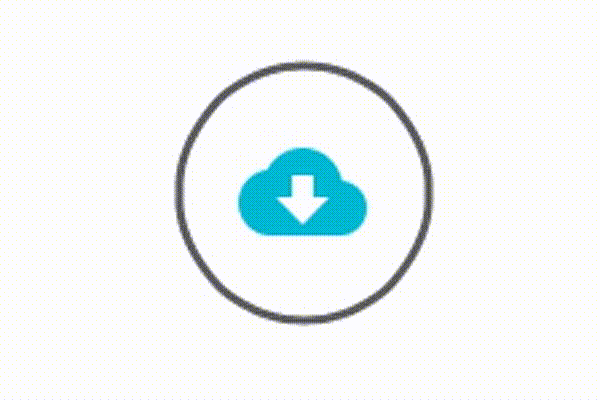
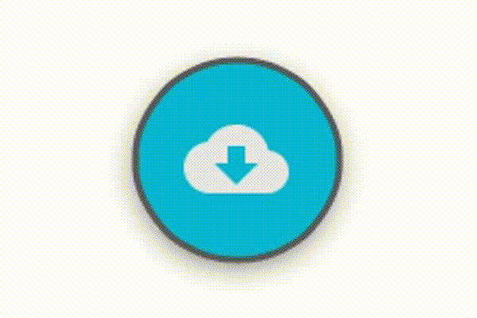
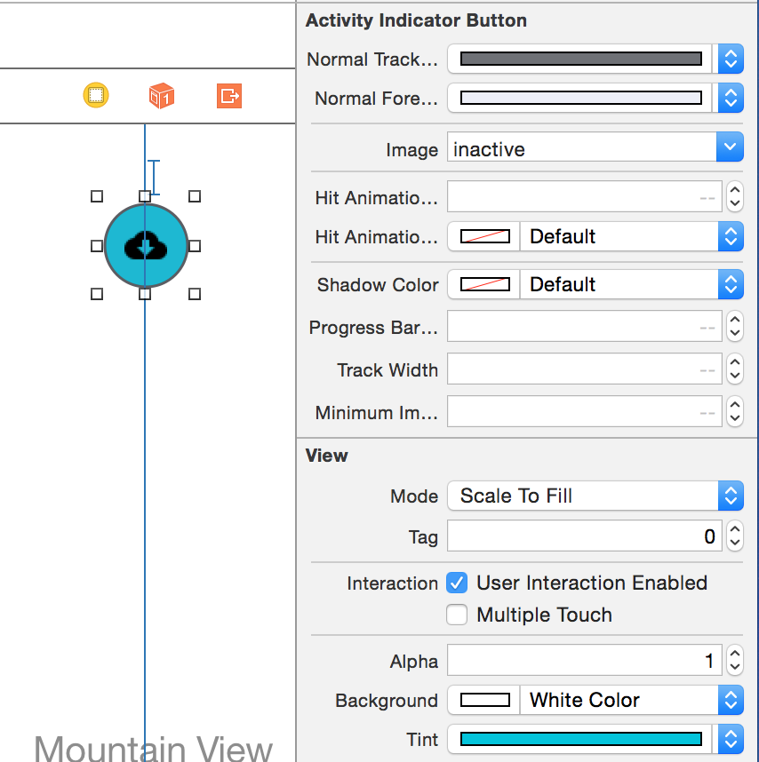
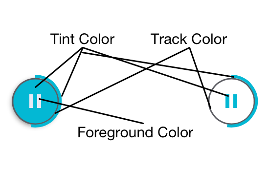

# JPCActivityIndicatorButton

ActivityIndicatorButton is an implementation of the progress control used in the App Store app and several other Apple apps. However the style is inspired by Google's material design. 

## UIButton, UIActivityIndicator, UIProgressView

It is a drop in replacement for UIActivityIndicatorView and UIProgressView that tracks touch input like a UIButton. It may be useful in the following scenarios
* Replacement for UIActivityIndicatorView
* Replacement for UIProgressView
* Replacement for UIButton with Google Material Design styling
* To create a similar interaction as start and stopping downloads in the App Store app. 

### Default "App Store" style


### Material Design Style


---


## Installation
### Cocoapods 

``` ruby
use_frameworks!
pod 'JPCActivityIndicatorButton'
```

### Manual
Copy ActivityIndicatorButton.swift into your project


## Usage

This control may be used in Storyboard or programmically.  It is IBDesignable so you can see a preview and edit its properties directly from interface builder.  Just add a UIView and change its type to "ActivityIndicatorButton".

### Programmatically
``` swift 
import JPCActivityIndicatorButton // Only if you use Pods or build as a module! (Which you should)

// ...

let button = ActivityIndicatorButton(frame: CGRectZero)
```

### Storyboard




### Layout

It defines instrincContentSize based on the size of the images. So like UIButton you don't need to define its width and height (unless you want to).


### Events
It inherits from UIControl so set touch events just like you would a UIButton.


### Components
The button consists of 4 components: progress bar, track, button, and image.  Heres how the colors are applied.



#### Style

The button supports two styles
* Solid (Material design inspired)
* Outline (Download button in App Store)

``` swift
button.style = .Solid  // or .Outline
```


### Quick Setup

#### Set the state of the progress bar
The circular progress bar has 3 states: 
* Inactive
* Spinning
* Percentage(value: Float)

You can directly set this by:
``` swift
button.activityState.progressBarStyle = .Inactive // .Spinning or .Percentage(value: .2)
```

#### Normal Colors

A given state may override the normal colors. However under normal operation you can set them directly. All these properties are IBInspectible.

``` swift 
button.tintColor = UIColor.blueColor()
button.normalTrackColor = UIColor.lightGreyColor()
button.normalForegroundColor = UIColor.whiteColor()
```


#### Image

The image is placed in the center of the button. If it is set to render as a template it will be tinted based on the style of the button.  For Solid style buttons the foregroundColor is used and for Outline buttons the tintColor is used.
Both of the following APIs set the image for the current state.  The "image" property is accessible from Storyboard.

```swift
button.activityState.image = UIImage(named: "tick")
// Or...
button.image = UIImage(named: "tick")
```


### Activity State
ActivityIndicatorButtonState is a struct containing the display properties for the button. You can create your own state struct and set it on the button.  This gives more flexibility over directly changing the properties as described in the "Quick Setup" section.  You can create multiple structs for different logic states of your button.

``` swift
/**
*  This struct defines the current state of an ActivityIndicatorButton.
*/
public struct ActivityIndicatorButtonState: Equatable {
  
    /// An optional property to help identify this button. Does not effect rendering is any way. Must be set to use the "SavedStates" feature.
    public let name: String?
    
    /// If this is set it will override the tintColor property on the button.
    public var tintColor: UIColor?
    
    /// If this is set it will override the "normalTrackColor" property on the button.
    public var trackColor: UIColor?
    
    /// If this is set it will override the "normalforegroundColor" property on the button.
    public var foregroundColor: UIColor?
    
    /// Optionally provide an image for this state. It is centered in the button.
    public var image: UIImage?
    
    /// The activity state of the button. 
    /// :see: ActivityIndicatorButtonProgressBarStyle
    public var progressBarStyle: ActivityIndicatorButtonProgressBarStyle
    
    /**
    Default initializer. No properties are required. All have default values.
    
    :param: name             Default value is nil
    :param: tintColor        Default value is nil
    :param: trackColor       Default value is nil
    :param: foregroundColor  Default value is nil
    :param: image            Default value is nil
    :param: progressBarStyle Default value is .Inactive
    */
    public init(name: String? = nil, tintColor: UIColor? = nil, trackColor: UIColor? = nil, foregroundColor: UIColor? = nil, image: UIImage? = nil, progressBarStyle: ActivityIndicatorButtonProgressBarStyle = .Inactive) {
        self.name = name
        self.tintColor = tintColor
        self.trackColor = trackColor
        self.foregroundColor = foregroundColor
        self.image = image
        self.progressBarStyle = progressBarStyle
    }
    
    /**
    Convenience function to set the progressBarStyle to .Percentage(value: value)
    */
    public mutating func setProgress(value: Float) {
        self.progressBarStyle = .Percentage(value: value)
    }
}
```

The current state is accessible on the button with this property:

``` swift
public var activityState: ActivityIndicatorButtonState
```


The activityState determines the following color properties.  All of which are treated as override for normal values. For example is tintColor is nil the tintColor property on UIView is used.  This allows you to create states such as a completed or errored with a different tint. The diagram below shows how each of the colors in applied.
* tintColor
* trackColor
* foregroundColor 

The image that will be displayed for the progress state
* image
 
The progress bar for this state
* progressBarStyle


### Saved States

The saved states feature is a handy way to manage buttons with multiple states. This is how the example projest is designed. These following APIs allow for you to easily create, store, and set states

``` swift
    public var savedStatesCount: Int
    
    // Access a saved state by name or change the value of a saved state. Setting to nil removes the state.
    public subscript (name: String) -> ActivityIndicatorButtonState? 
    
    // Saves an array of state. The name property MUST be set.  Does not remove existing states
    public func saveStates(states: [ActivityIndicatorButtonState]) 
    
    // Change the activityState to one of the saved states
    public func transitionSavedState(name: String, animated: Bool = true) -> Bool
```

Since we are using Value Types we don't have to worry about changing the activityState value after setting a stored state.  Since it is not passed by reference all saved states are unaffected. 

Here's an example setup

``` swift
// Create names for easy reference
struct Names {
        static let Inactive = "Inactive", Spinning = "Spinning", ProgressBar = "Progress Bar", Paused = "Paused", Complete = "Complete", Error = "Error"
    }

// Create our states
button.saveStates([
            ActivityIndicatorButtonState(name: Names.Inactive, image: UIImage(named: "inactive")),
            ActivityIndicatorButtonState(name: Names.Spinning, progressBarStyle: .Spinning),
            ActivityIndicatorButtonState(name: Names.ProgressBar, image: UIImage(named: "pause"), progressBarStyle: .Percentage(value: 0)),
            ActivityIndicatorButtonState(name: Names.Paused, image: UIImage(named: "play"), progressBarStyle: .Percentage(value: 0)),
            ActivityIndicatorButtonState(name: Names.Complete, tintColor: UIColor(red:0.0, green:0.78, blue:0.33, alpha:1.0), image: UIImage(named: "complete")),
            ActivityIndicatorButtonState(name: Names.Error, tintColor: UIColor(red:0.84, green:0.0, blue:0.0, alpha:1.0), image: UIImage(named: "error"))
])

// Change a value in one of our states
button[Names.ProgressBar].setProgress(0.35)

// Set a saved state
button.transitionSavedState(Names.ProgressBar)
```


